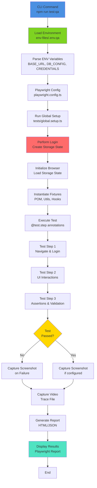
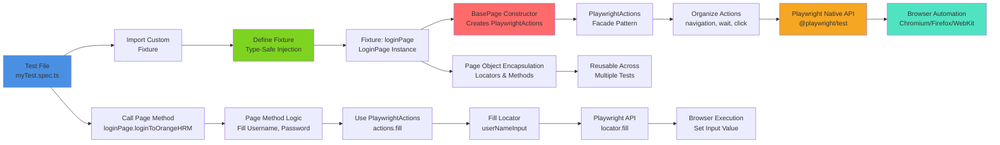
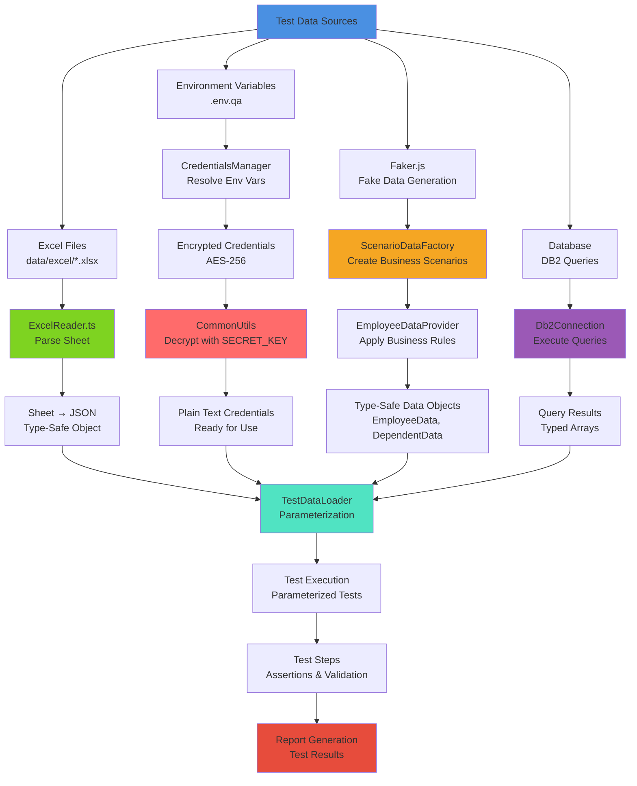

# PlaywrightWithTypescript

## 🚀 Project Overview & Architecture

This is a **production-grade, enterprise-scale Playwright TypeScript test automation framework** designed for comprehensive UI and database testing of web applications. The project demonstrates professional SDET (Software Development Engineer in Test) practices with a focus on the Orange HRM application as a reference implementation.

### Core Framework Goals:

- **Modular Architecture**: Clean separation of concerns using Page Object Model (POM) and fixtures-based architecture
- **Type-Safe Automation**: Leverages TypeScript for compile-time type checking and reduced runtime errors
- **Data-Driven Testing**: Supports multi-source test data integration (Excel, JSON, environment variables, database)
- **Secure Credential Management**: Encryption/decryption of sensitive credentials using AES encryption
- **Database Validation**: Direct DB2 connection for backend validation and query execution
- **Comprehensive Reporting**: Built-in HTML reporting with screenshot/video capture on failures
- **Extensible Utility Layer**: Reusable action wrappers and custom fixture management

### Tech Stack & Core Dependencies:

| Component          | Technology                                                       | Version   |
| ------------------ | ---------------------------------------------------------------- | --------- |
| **Test Framework** |  | ^1.62.1   |
| **Language**       |   | ^7.0.2    |
| **Runtime**        |       | 20.x LTS+ |
| **Data Handling**  |           | ^0.18.5   |
| **Encryption**     |       | ^4.2.0    |
| **Test Data**      |       | ^10.5.0   |
| **Database**       |         | ^4.0.1    |
| **Environment**    |     | ^17.4.2   |
| **Cross-Platform** |   | ^10.1.0   |

---

## 📁 Folder & Directory Structure

```
PlaywrightWithTypescript/
│
├── 📄 README.md                          # Project documentation and onboarding guide
├── 📄 package.json                       # NPM dependencies and test scripts
├── 📄 playwright.config.ts               # Playwright configuration (timeouts, reporters, projects)
├── 📄 tsconfig.json                      # TypeScript compiler configuration
├── 📄 INFISICAL_README.md                # Environment variable management guide
│
├── 📁 config/                            # Application configuration files
│   └── 📄 data-paths.ts                  # Centralized test data path definitions
│
├── 📁 core/                              # Core framework abstractions
│   ├── 📄 BasePage.ts                    # Abstract base class for all Page Objects
│   ├── 📁 playwright/                    # Playwright API wrappers for UI interactions
│   │   ├── 📄 PlaywrightActions.ts       # Main action orchestrator (facade pattern)
│   │   ├── 📄 NavigationActions.ts       # URL navigation and history management
│   │   ├── 📄 WaitActions.ts             # Explicit waits and element state verification
│   │   ├── 📄 ClickActions.ts            # Click and interaction wrappers
│   │   ├── 📄 MouseActions.ts            # Mouse movements and interactions
│   │   ├── 📄 KeyboardActions.ts         # Keyboard input simulation
│   │   ├── 📄 FileActions.ts             # File upload and download handling
│   │   ├── 📄 FrameActions.ts            # iframe/frame navigation
│   │   ├── 📄 DailogActions.ts           # Alert/dialog handling
│   │   └── 📄 playwrightApi.ReadMe.md    # Playwright API documentation reference
│   └── 📁 assertion/                     # Custom assertion utilities (extensible)
│       └── 📄 PlaywrightAssertions.ts    # Custom assertion helpers
│
├── 📁 data/                              # Test data storage (multi-format)
│   ├── 📁 excel/                         # Excel-based test data files
│   │   └── 📄 orangeHRM.xlsx             # Employee/dependent data, login credentials
│   ├── 📁 generated/                     # Dynamically generated test data
│   │   └── 📄 dependents.json            # Generated dependent information
│   └── 📁 normalised-json/               # Converted/normalized JSON data
│       └── 📄 excelToJson.json           # Excel-to-JSON conversion output
│
├── 📁 env-files/                         # Environment-specific configuration files
│   └── 📄 .env.qa                        # QA environment variables (encrypted credentials, DB config)
│
├── 📁 fixtures/                          # Playwright test fixtures (custom test setup)
│   ├── 📄 pom-fixtures.ts                # Page Object Model fixture injection
│   ├── 📄 common-fixtures.ts             # Common utilities (CommonUtils, encryption)
│   ├── 📄 hooks-fixtures.ts              # beforeEach/afterEach hooks (login/logout)
│   ├── 📄 credentials-fixtures.ts        # Pre-decrypted credential fixture
│   └── 📄 {other}-fixtures.ts            # Custom feature-specific fixtures
│
├── 📁 pages/                             # Page Object Model (POM) implementation
│   ├── 📄 LoginPage.ts                   # OrangeHRM login page object
│   ├── 📄 PersonalDetailsPage.ts         # Personal details/employee records page
│   └── 📄 {Feature}Page.ts               # Feature-specific page objects
│
├── 📁 sections/                          # Reusable UI sections (shared components)
│   ├── 📄 UserProfileMenu.ts             # User menu and profile section
│   ├── 📄 LeftNavigationItems.ts         # Left sidebar navigation
│   └── 📄 {Feature}Section.ts            # Feature-specific sections
│
├── 📁 tests/                             # Test specifications and scenarios
│   ├── 📄 global.setup.ts                # Global setup: login and storage state creation
│   ├── 📄 loginPageTest-NoAuthNeeded.spec.ts      # UI validation tests (no auth)
│   ├── 📄 storageStateExampleUsage_*.spec.ts      # Examples of using cached auth state
│   ├── 📄 test-1.spec.ts                 # Sample test implementations
│   ├── 📁 databaseTests/                 # Database validation test suite
│   │   └── 📄 databaseTestValidation.spec.ts      # DB2 query validation tests
│   ├── 📁 fakerModuleDemo/               # Faker.js for test data generation
│   │   └── 📄 fakerTestDataDependentDetails.spec.ts # Dynamic employee scenario generation
│   ├── 📁 infisical_excel_testdata/      # Data-driven tests from Excel + Infisical
│   │   └── 📄 testdataDrivenTest.spec.ts # Parameterized login tests
│   └── 📁 PersonalDetailsModule/         # Feature module tests
│       └── 📄 personalDetailsTest.spec.ts # File upload/download and form validation
│
├── 📁 types/                             # TypeScript type definitions and interfaces
│   ├── 📄 Credentials.ts                 # Credential interface definition
│   ├── 📄 EmployeeData.ts                # Employee and dependent data structures
│   ├── 📄 EnvironmentConfig.ts           # Environment configuration types
│   ├── 📄 LoginTestData.ts               # Login test parameterization types
│   └── 📄 {Feature}Types.ts              # Feature-specific type definitions
│
├── 📁 utils/                             # Reusable utility functions
│   ├── 📄 CommonUtils.ts                 # Encryption/decryption utilities
│   ├── 📄 CredentialsManager.ts          # Environment variable credential resolution
│   ├── 📄 EnvironmentManager.ts          # Environment config retrieval
│   ├── 📄 ExcelReader.ts                 # Excel file parsing (XLSX library wrapper)
│   ├── 📄 TestDataLoader.ts              # Excel-to-JSON data loading and conversion
│   ├── 📁 DatabaseUtils/                 # Database connectivity and queries
│   │   ├── 📄 Db2Connection.ts           # IBM DB2 connection management
│   │   └── 📄 Db2Queries.ts              # Predefined database queries
│   └── 📁 TestDataUtilities/             # Advanced test data management
│       ├── 📄 DataFactory.ts             # Abstract data factory pattern
│       ├── 📄 DependentDataFactory.ts    # Factory for dependent-specific data
│       ├── 📄 EmployeeDataProvider.ts    # Employee data retrieval and filtering
│       ├── 📄 ScenarioDataFactory.ts     # Business rule-based scenario generation
│       ├── 📄 JsonDataWriter.ts          # JSON file output for generated data
│       ├── 📄 types.ts                   # TestDataUtilities type definitions
│       └── 📄 ReadMe.md                  # Data factory documentation
│
├── 📁 playwright/                        # Playwright-generated artifacts
│   ├── 📁 .auth/                         # Stored authentication state
│   │   └── 📄 globalStorageState.json    # Browser cookies and session state
│   └── [generated test reports]
│
├── 📁 playwright-report/                 # HTML test report output
│   └── 📄 index.html                     # Consolidated test execution report
│
├── 📁 test-results/                      # Detailed test result logs
│   └── [test execution artifacts]
│
└── 📁 setup/                             # Setup utilities and initialization scripts
    └── [setup-specific files]
```

---

## 🛠️ Environment & Prerequisites Setup

### System Requirements

| Requirement    | Minimum                     | Recommended                          |
| -------------- | --------------------------- | ------------------------------------ |
| **Node.js**    | 18.x LTS                    | 20.x LTS                             |
| **NPM**        | 8.x                         | 10.x+                                |
| **OS**         | Windows 10+ / macOS / Linux | Windows 11, macOS 12+, Ubuntu 22.04+ |
| **RAM**        | 4 GB                        | 8 GB+                                |
| **Disk Space** | 2 GB                        | 5 GB+                                |

### Step 1: Clone and Install Dependencies

```bash
# Clone the repository
git clone <repository-url>
cd PlaywrightWithTypescript

# Install Node.js dependencies
npm install

# Install Playwright browsers
npx playwright install chromium firefox webkit

# Verify TypeScript installation
npx tsc --version
```

### Step 2: Environment Configuration

#### `.env` File Structure & Variables

Create environment-specific files in `env-files/` directory:

**File**: `env-files/.env.qa`

```bash
# ============================================================
# APPLICATION CONFIGURATION
# ============================================================

# Base URL for the application under test
BASE_URL=https://opensource-demo.orangehrmlive.com/web/index.php/auth/login

# API base URL (if testing API alongside UI)
API_BASE_URL=https://api.example.com/v1

# Environment identifier (used in configuration loading)
ENV_NAME=qa

# ============================================================
# CREDENTIALS (AES-256 Encrypted)
# ============================================================
# IMPORTANT: All credentials are encrypted using crypto-js
# Encryption: CommonUtils.encryptData(plaintext, SECRET_KEY)
# Decryption: CommonUtils.decryptData(encryptedText, SECRET_KEY)
# Use SECRET_KEY environment variable passed at runtime via cross-env

# Valid user credentials for successful login tests
VALID_USERNAME=U2FsdGVkX19z0jyjugcMnc46FU4MJfk8knjKAoSgW+Y=
VALID_PASSWORD=U2FsdGVkX1/t1p5Q8SS49q++B++ylamp9sczGj8u1po=

# Invalid credentials for negative/failure scenario tests
INVALID_USERNAME=U2FsdGVkX19z0jyjugcMnc46FU4MJfk8knjKAoSgW+Y=
INVALID_PASSWORD=U2FsdGVkX19z0jyjugcMnc46FU4MJfk8knjKAoSgW+Y=

# Primary employee for Orange HRM operations (used in global.setup.ts)
ORG_HRM_USR_NAME=U2FsdGVkX19z0jyjugcMnc46FU4MJfk8knjKAoSgW+Y=
ORG_HRM_PASSWORD=U2FsdGVkX1/t1p5Q8SS49q++B++ylamp9sczGj8u1po=

# ============================================================
# DATABASE CONFIGURATION (IBM DB2)
# ============================================================
# Note: Database tests require actual DB2 instance configuration

# Database name
DB2_DATABASE=ORANGEHRM_DB

# Database hostname/IP
DB2_HOSTNAME=db2-qa.company.com

# Database connection port
DB2_PORT=50000

# Database username
DB2_USERNAME=qa_user

# Database password (encrypted)
DB2_PASSWORD=encrypted_password_here

# Secret key for encryption/decryption (passed at runtime)
# Command: cross-env SECRET_KEY=your_secret_key npx playwright test
# SECRET_KEY=your_secret_key_here
```

#### Environment Variable Usage Guide

| Variable           | Type                 | Purpose                                | Example                                         |
| ------------------ | -------------------- | -------------------------------------- | ----------------------------------------------- |
| `BASE_URL`         | Required             | Main application URL                   | `https://opensource-demo.orangehrmlive.com/...` |
| `API_BASE_URL`     | Optional             | API endpoint for backend tests         | `https://api.example.com/v1`                    |
| `ENV_NAME`         | Required             | Environment identifier                 | `qa`, `uat`, `staging`                          |
| `VALID_USERNAME`   | Required (Encrypted) | User account for successful login      | Encrypted via crypto-js                         |
| `VALID_PASSWORD`   | Required (Encrypted) | Password for valid user                | Encrypted via crypto-js                         |
| `INVALID_USERNAME` | Optional (Encrypted) | Invalid credentials for negative tests | Encrypted via crypto-js                         |
| `INVALID_PASSWORD` | Optional (Encrypted) | Invalid password for negative tests    | Encrypted via crypto-js                         |
| `DB2_DATABASE`     | Optional             | Database name for backend validation   | `ORANGEHRM_DB`                                  |
| `DB2_HOSTNAME`     | Optional             | DB2 host address                       | `db2-qa.company.com`                            |
| `DB2_PORT`         | Optional             | DB2 port                               | `50000`                                         |
| `DB2_USERNAME`     | Optional             | Database user account                  | `qa_user`                                       |
| `DB2_PASSWORD`     | Optional (Encrypted) | Database password                      | Encrypted via crypto-js                         |
| `SECRET_KEY`       | Required (Runtime)   | Encryption/decryption key              | `raja143` (passed via cross-env)                |

#### Credential Encryption Example

```typescript
// Encrypt credentials before storing in .env file:
import CommonUtils from './utils/CommonUtils';

const utils = new CommonUtils(); // Uses SECRET_KEY from process.env
const encrypted = utils.encryptData('admin123');
console.log(encrypted); // U2FsdGVkX1/t1p5Q8SS49q++B++ylamp9sczGj8u1po=

// Decryption happens automatically in tests:
const decrypted = utils.decryptData(encrypted);
console.log(decrypted); // "admin123"
```

### Step 3: Verify Installation

```bash
# Check Node.js version
node --version        # Should be v18.0.0 or higher

# Check NPM version
npm --version         # Should be 8.0.0 or higher

# Verify Playwright installation
npx playwright --version

# Run a sample test
npm run test:qa
```

---

## 🏗️ Core Framework Components & Architecture

### 1. Page Object Model (POM) Pattern

The framework implements a **hierarchical, inheritance-based POM** architecture with clean separation between page definitions and interaction logic.

#### BasePage Abstract Class

All page objects inherit from `BasePage`, which provides access to `PlaywrightActions` wrapper:

```typescript
// File: core/BasePage.ts
export abstract class BasePage {
  protected readonly actions: PlaywrightActions;

  constructor(protected readonly page: Page) {
    this.actions = new PlaywrightActions(page);
  }
}
```

**Key Design Principles:**

- **Encapsulation**: Locators are private/protected, methods are public
- **Single Responsibility**: Each page class represents one logical page/section
- **Reusability**: Shared actions inherit from BasePage
- **Type Safety**: All methods are strictly typed with TypeScript interfaces

#### Page Object Implementation Example

```typescript
// File: pages/LoginPage.ts
export class LoginPage extends BasePage {
  // Private locators - only accessible via methods
  readonly userNameInput: Locator;
  readonly passwordInput: Locator;
  readonly loginButton: Locator;

  constructor(page: Page) {
    super(page);
    // Locators use semantic role-based selectors (accessibility-first)
    this.userNameInput = page.getByRole('textbox', { name: 'Username' });
    this.passwordInput = page.getByRole('textbox', { name: 'Password' });
    this.loginButton = page.getByRole('button', { name: 'Login' });
  }

  // Public business logic methods
  async goToOrangeHRMLoginPage(url: string) {
    await this.actions.navigation.goto(url, {
      waitUntil: 'domcontentloaded',
    });
  }

  async loginToOrangeHRM(username: string, password: string) {
    await this.actions.fill(this.userNameInput, username);
    await this.actions.fill(this.passwordInput, password);
    await this.actions.click(this.loginButton);
  }
}
```

#### Section Objects (Reusable Components)

Sections represent shared UI components used across multiple pages:

```typescript
// File: sections/LeftNavigationItems.ts
export class LeftNavigationItems extends BasePage {
  readonly myInfo: Locator;

  constructor(page: Page) {
    super(page);
    this.myInfo = page.getByRole('link', { name: 'My Info' });
  }

  async clickOnMyInfoLink() {
    await this.actions.click(this.myInfo);
    await this.actions.wait.forUrl(/viewPersonalDetails/);
  }
}
```

**Locator Strategy: Accessibility-First Approach**

- Primary: `getByRole()` (semantic HTML)
- Secondary: `getByLabel()` (form labels)
- Tertiary: `getByPlaceholder()`, `getByText()` (content-based)
- Last Resort: CSS selectors, XPath (brittle, avoid when possible)

---

### 2. Custom Fixtures Architecture

Playwright fixtures provide **dependency injection** and **setup/teardown** management. The framework extends base Playwright fixtures with custom Page Objects and utilities.

#### Fixture Hierarchy

```
@playwright/test (Base)
    ↓
pom-fixtures.ts (Page Objects)
    ↓
common-fixtures.ts (CommonUtils)
    ↓
credentials-fixtures.ts (Decrypted Credentials)
    ↓
hooks-fixtures.ts (Before/After Hooks)
```

#### POM Fixtures (pom-fixtures.ts)

```typescript
// File: fixtures/pom-fixtures.ts
import { test as base } from '@playwright/test';
import { LoginPage } from '../pages/LoginPage';
import { PersonalDetailsPage } from '../pages/PersonalDetailsPage';
import { UserProfileMenu } from '../sections/UserProfileMenu';
import { LeftNavigationItems } from '../sections/LeftNavigationItems';

type MyFixtures = {
  loginPage: LoginPage;
  personalDetailsPage: PersonalDetailsPage;
  userProfileMenu: UserProfileMenu;
  leftNavigationItems: LeftNavigationItems;
};

const test = base.extend<MyFixtures>({
  loginPage: async ({ page }, use) => {
    // Setup: Instantiate LoginPage with current page context
    await use(new LoginPage(page));
    // Teardown: Any cleanup happens here
  },

  personalDetailsPage: async ({ page }, use) => {
    await use(new PersonalDetailsPage(page));
  },

  userProfileMenu: async ({ page }, use) => {
    await use(new UserProfileMenu(page));
  },

  leftNavigationItems: async ({ page }, use) => {
    await use(new LeftNavigationItems(page));
  },
});

export { test };
```

**Usage in Tests:**

```typescript
import { test } from '../fixtures/pom-fixtures';

test('Login to OrangeHRM', async ({ loginPage }) => {
  await loginPage.goToOrangeHRMLoginPage('https://...');
  await loginPage.loginToOrangeHRM('admin', 'admin123');
});
```

#### Common Utilities Fixture

```typescript
// File: fixtures/common-fixtures.ts
import { test as base } from '../fixtures/pom-fixtures';
import CommonUtils from '../utils/CommonUtils';

type CommonUtilsFixture = {
  commonUtils: CommonUtils;
};

const test = base.extend<CommonUtilsFixture>({
  commonUtils: async ({}, use) => {
    // Provides encryption/decryption utilities to all tests
    await use(new CommonUtils());
  },
});

export { test };
```

#### Credentials Fixture (Pre-Decrypted)

```typescript
// File: fixtures/credentials-fixtures.ts
type Fixtures = {
  decryptedValidCredentials: {
    app_username: string;
    app_password: string;
  };
};

const test = base.extend<Fixtures>({
  decryptedValidCredentials: async ({ commonUtils }, use) => {
    // Automatically decrypts credentials from environment variables
    const encryptedUsername = process.env.VALID_USERNAME as string;
    const encryptedPassword = process.env.VALID_PASSWORD as string;

    const app_username = commonUtils.decryptData(encryptedUsername);
    const app_password = commonUtils.decryptData(encryptedPassword);

    // Fixture provides pre-decrypted credentials to tests
    await use({
      app_username,
      app_password,
    });
  },
});

export { test };
```

#### Hooks Fixture (BeforeEach/AfterEach)

```typescript
// File: fixtures/hooks-fixtures.ts
type Hooks = {
  beforeAfterHook: void;
};

const test = base.extend<Hooks>({
  beforeAfterHook: async ({ loginPage, userProfileMenu }, use) => {
    // BEFORE EACH TEST
    console.log('Before Test: Logging in...');
    await loginPage.goToOrangeHRMLoginPage(process.env.BASE_URL as string);

    // TEST EXECUTION
    await use();

    // AFTER EACH TEST
    console.log('After Test: Logging out...');
    await userProfileMenu.clickOnHamburgerMenu();
    await userProfileMenu.clickLogoutLink();
  },
});

export { test };
```

---

### 3. Test Structure & Organization

#### Test File Organization

Tests follow a **module-based structure** with clear separation of concerns:

```
tests/
├── global.setup.ts                    # Setup project: runs once before all tests
├── loginPageTest-NoAuthNeeded.spec.ts # Tests requiring fresh login
├── storageStateExampleUsage.spec.ts   # Tests using cached authentication
├── databaseTests/                     # DB validation tests
├── fakerModuleDemo/                   # Test data generation examples
├── infisical_excel_testdata/          # Data-driven tests
└── PersonalDetailsModule/             # Feature-specific tests
```

#### Test Tags and Annotations

Tests use **tags** for filtering and **annotations** for metadata:

```typescript
test(
  'Validate landing page',
  {
    tag: ['@login', '@UAT', '@UI', '@VisualTesting'],
    annotation: [
      {
        type: 'Test Case Link',
        description: 'https://jira.com/browse/TEST-123',
      },
      {
        type: 'Defect',
        description: 'https://jira.com/browse/BUG-456',
      },
    ],
  },
  async ({ loginPage }) => {
    // Test implementation
  },
);
```

**Common Tags:**

- `@Regression` - Core functionality tests
- `@Smoke` - Critical path tests
- `@UI` - User interface tests
- `@Database` - Backend validation tests
- `@VisualTesting` - Screenshot comparison tests
- `@UAT` - User acceptance testing
- `@EndToEnd` - Full workflow tests
- `@Faker` - Tests using generated data

#### Storage State (Pre-Authentication)

The framework uses **Playwright storage state** to avoid repeated login:

```typescript
// File: tests/global.setup.ts
test('Global Setup (Auth storage state) for Auto Login', async ({
  page,
  commonUtils,
  loginPage,
}) => {
  let url = process.env.BASE_URL as string;
  let encryptedUsername = process.env.ORG_HRM_USR_NAME as string;
  let encryptedPassword = process.env.ORG_HRM_PASSWORD as string;

  // Decrypt credentials
  let decryptedUsername = commonUtils.decryptData(encryptedUsername);
  let decryptedPassword = commonUtils.decryptData(encryptedPassword);

  // Perform login
  await loginPage.goToOrangeHRMLoginPage(url);
  await loginPage.loginToOrangeHRM(decryptedUsername, decryptedPassword);

  // Save browser state (cookies, session storage, etc.)
  await page.context().storageState({
    path: './playwright/.auth/globalStorageState.json',
  });
});
```

**Configuration in playwright.config.ts:**

```typescript
projects: [
  {
    name: 'setup',
    testMatch: 'global.setup.ts',
  },
  {
    name: 'chromium',
    use: {
      ...devices['Desktop Chrome'],
      storageState: 'playwright/.auth/globalStorageState.json',
    },
    dependencies: ['setup'],
  },
];
```

#### Test Steps for Better Reporting

```typescript
await test.step('Navigate to Orange HRM Login Page', async () => {
  await loginPage.goToOrangeHRMLoginPage(EnvironmentManager.getBaseUrl());
});

await test.step('Login into Orange HRM using valid credentials', async () => {
  await loginPage.loginToOrangeHRM(decryptedUserName, decryptedPassword);
});

await test.step('Validate user is able to login into Orange HRM', async () => {
  await expect(page).toHaveURL((url) => {
    return url.toString().includes('dashboard');
  });
});
```

---

### 4. Test Data Handlers & Data Providers

The framework supports **multi-source test data** with type-safe loading and transformation:

#### Excel-Based Data Loading

**Source File**: `data/excel/orangeHRM.xlsx`

```typescript
// File: utils/ExcelReader.ts
export class ExcelReader {
  static readSheet<T>(filePath: string, sheetName: string): T[] {
    const workbook = XLSX.readFile(filePath);
    const worksheet = workbook.Sheets[sheetName];

    if (!worksheet) {
      throw new Error(`Worksheet '${sheetName}' not found in ${filePath}`);
    }

    return XLSX.utils.sheet_to_json<T>(worksheet, { defval: '' });
  }
}
```

**Usage - Test Data Loader:**

```typescript
// File: utils/TestDataLoader.ts
export class TestDataLoader {
  static getLoginData(): LoginTestData[] {
    const filePath = DataPath.orangeHRM;
    const data = ExcelReader.readSheet<LoginTestData>(filePath, DataSheet.login);

    // Convert to JSON for reference
    fs.writeFileSync(DataPath.convertedJson, JSON.stringify(data, null, 2), 'utf-8');

    return data;
  }
}
```

#### Data-Driven Test Parameterization

```typescript
// File: tests/infisical_excel_testdata/testdataDrivenTest.spec.ts
import { TestDataLoader } from '../../utils/TestDataLoader';

test.describe('Test data driven testing', () => {
  const loginData: LoginTestData[] = TestDataLoader.getLoginData();

  loginData.forEach((data) => {
    test(
      `${data.Scenario} - USER: ${data.UsernameKey}`,
      { tag: ['@EndToEnd', '@TestDataExcelToJson'] },
      async ({ page, commonUtils, loginPage, userProfileMenu }) => {
        await test.step('Navigate to Orange HRM Login Page', async () => {
          await loginPage.goToOrangeHRMLoginPage(EnvironmentManager.getBaseUrl());
        });

        const credentials = CredentialsManager.getCredentials(data.UsernameKey, data.PasswordKey);

        let decryptedUserName = commonUtils.decryptData(credentials.username);
        let decryptedPassword = commonUtils.decryptData(credentials.password);

        await test.step('Login into Orange HRM using valid credentials', async () => {
          await loginPage.loginToOrangeHRM(decryptedUserName, decryptedPassword);
        });

        await test.step('Validate login result', async () => {
          if (data.ExpectedResult === 'success') {
            await expect(page).toHaveURL((url) => url.toString().includes('dashboard'));
          } else {
            await expect(page.getByText('Invalid credentials')).toBeVisible();
          }
        });
      },
    );
  });
});
```

#### Employee Data Provider (Business Logic)

```typescript
// File: utils/TestDataUtilities/EmployeeDataProvider.ts
export class EmployeeDataProvider {
  private static readEmployees(): EmployeeData[] {
    const workbook = XLSX.readFile(DataPath.orangeHRM);
    const worksheet = workbook.Sheets[DataSheet.employee];

    return XLSX.utils.sheet_to_json<EmployeeData>(worksheet, { defval: '' });
  }

  // Get all employees
  public static getEmployees(): EmployeeData[] {
    return this.readEmployees();
  }

  // Get employee by specific ID
  public static getEmployeeById(employeeId: string): EmployeeData {
    const employees = this.readEmployees();
    const employee = employees.find((emp) => emp.employeeId === employeeId);

    if (!employee) {
      throw new Error(`Employee '${employeeId}' not found in Excel`);
    }

    return employee;
  }

  // Get employee by marital status (returns random employee)
  public static getEmployeeByMaritalStatus(maritalStatus: MaritalStatus): EmployeeData {
    const employees = this.readEmployees();
    const matchingEmployees = employees.filter((emp) => emp.maritalStatus === maritalStatus);

    if (matchingEmployees.length === 0) {
      throw new Error(`No employee found with marital status '${maritalStatus}'`);
    }

    return this.randomEmployee(matchingEmployees);
  }

  private static randomEmployee(employees: EmployeeData[]): EmployeeData {
    const index = Math.floor(Math.random() * employees.length);
    return employees[index];
  }
}
```

#### Scenario-Based Data Factory

```typescript
// File: utils/TestDataUtilities/ScenarioDataFactory.ts
export class ScenarioDataFactory {
  // Business rule: Married employee with spouse dependent
  public static createMarriedScenario(): EmployeeScenarioData {
    const employee = this.findEmployeeForMarriedScenario();

    return {
      scenario: 'MARRIED',
      employee,
      dependents: [DependentDataFactory.createSpouse(employee)],
    };
  }

  // Business rule: Single employee with no dependents
  public static createSingleScenario(): EmployeeScenarioData {
    const employee = this.findEmployeeForSingleScenario();

    return {
      scenario: 'SINGLE',
      employee,
      dependents: [],
    };
  }

  // Business rule: 401k catch-up scenario
  public static create401kCatchUpScenario(): EmployeeScenarioData {
    const employee = this.findEmployeeFor401kCatchUp();

    const dependents =
      employee.maritalStatus === 'M' ? [DependentDataFactory.createSpouse(employee)] : [];

    return {
      scenario: '401K_CATCH_UP',
      employee,
      dependents,
    };
  }
}
```

**Usage in Tests:**

```typescript
// File: tests/fakerModuleDemo/fakerTestDataDependentDetails.spec.ts
const scenario = ScenarioDataFactory.create401kCatchUpScenario();

console.log('Selected employee:', scenario.employee);
console.log('Generated dependents:', scenario.dependents);

JsonDataWriter.write(scenario);
```

---

### 5. Database Connections & Utilities

The framework supports **IBM DB2 backend validation** for comprehensive end-to-end testing:

#### DB2 Connection Management

```typescript
// File: utils/DatabaseUtils/Db2Connection.ts
import ibmdb from 'ibm_db';

export class Db2Connection {
  private static connectionString(): string {
    return [
      `DATABASE=${process.env.DB2_DATABASE}`,
      `HOSTNAME=${process.env.DB2_HOSTNAME}`,
      `PORT=${process.env.DB2_PORT}`,
      `UID=${process.env.DB2_USERNAME}`,
      `PWD=${process.env.DB2_PASSWORD}`,
      `PROTOCOL=TCPIP`,
    ].join(';');
  }

  static async connect() {
    return await ibmdb.open(this.connectionString());
  }

  static async query<T = any>(sql: string, parameters: any[] = []): Promise<T[]> {
    const connection = await this.connect();

    try {
      const result = await connection.query(sql, parameters);
      return result as T[];
    } finally {
      await connection.close();
    }
  }
}
```

#### DB2 Queries Wrapper

```typescript
// File: utils/DatabaseUtils/Db2Queries.ts
export class Db2Queries {
  static async getEmployeeById(employeeId: number) {
    const sql = 'SELECT * FROM EMPLOYEES WHERE EMPLOYEE_ID = ?';
    return await Db2Connection.query(sql, [employeeId]);
  }

  static async getEmployeesUnderManager(managerId: number, department: string) {
    const sql = `
            SELECT * FROM EMPLOYEES 
            WHERE MANAGER_ID = ? AND DEPARTMENT = ?
        `;
    return await Db2Connection.query(sql, [managerId, department]);
  }

  static async getEmployeeByName(firstName: string, lastName: string) {
    const sql = `
            SELECT * FROM EMPLOYEES 
            WHERE FIRST_NAME = ? AND LAST_NAME = ?
        `;
    return await Db2Connection.query(sql, [firstName, lastName]);
  }
}
```

#### Database Test Example

```typescript
// File: tests/databaseTests/databaseTestValidation.spec.ts
import { test, expect } from '@playwright/test';
import { Db2Queries } from '../../utils/DatabaseUtils/Db2Queries';

test('Validate employee in DB', { tag: ['@UI', '@Database'] }, async () => {
  const employeeId = 1001;

  // Query database
  const result = await Db2Queries.getEmployeeById(employeeId);

  // Assertions
  expect(result).toHaveLength(1);
  expect(result[0].EMPLOYEE_ID).toBe(employeeId);

  // Query employees under manager
  const result2 = await Db2Queries.getEmployeesUnderManager(100, 'IT');
  console.log(result2);
});
```

---

### 6. Parameterization & Data-Driven Testing

The framework implements multiple parameterization strategies:

#### Strategy 1: Test.Each (Array Parameterization)

```typescript
const testCases = [
  { username: 'admin', password: 'admin123', expected: 'success' },
  { username: 'user1', password: 'user123', expected: 'success' },
  { username: 'invalid', password: 'wrong', expected: 'failure' },
];

testCases.forEach((testCase) => {
  test(`Login test - ${testCase.username}`, async ({ loginPage }) => {
    await loginPage.loginToOrangeHRM(testCase.username, testCase.password);
    // Assert based on testCase.expected
  });
});
```

#### Strategy 2: Excel-Based Parameterization

```typescript
const loginData = TestDataLoader.getLoginData();

loginData.forEach((data) => {
  test(`Test: ${data.Scenario}`, async ({ loginPage }) => {
    const credentials = CredentialsManager.getCredentials(data.UsernameKey, data.PasswordKey);
    // Test implementation
  });
});
```

#### Strategy 3: Faker-Generated Data

```typescript
test('Create dependent for 401k catch-up employee', async () => {
  const scenario = ScenarioDataFactory.create401kCatchUpScenario();
  const dependent = scenario.dependents[0];

  // Use dynamically generated data in test
  await employeePage.addDependent(dependent);
});
```

#### Strategy 4: Test.Use (Context-Based Parameterization)

```typescript
const environments = ['qa', 'uat', 'staging'];

environments.forEach((env) => {
  test.describe(`Tests for ${env}`, () => {
    test.use({
      baseURL: getBaseURLForEnvironment(env),
    });

    test('Test case', async ({ page }) => {
      // Test runs with specified base URL
    });
  });
});
```

---

### 7. Helper Utilities

#### Encryption/Decryption (CommonUtils)

```typescript
// File: utils/CommonUtils.ts
export default class CommonUtils {
  private secretKey: string;

  constructor() {
    if (!process.env.SECRET_KEY) {
      throw new Error('SECRET_KEY environment variable is not defined.');
    }
    this.secretKey = process.env.SECRET_KEY;
  }

  public encryptData(data: string): string {
    const encryptedData = cryptojs.AES.encrypt(data, this.secretKey).toString();
    console.log(`Encrypted: ${encryptedData}`);
    return encryptedData;
  }

  public decryptData(encryptedData: string): string {
    const decryptedData = cryptojs.AES.decrypt(encryptedData, this.secretKey).toString(
      cryptojs.enc.Utf8,
    );
    return decryptedData;
  }
}
```

#### Environment Management

```typescript
// File: utils/EnvironmentManager.ts
export class EnvironmentManager {
  static getEnvironment(): string {
    return (process.env.ENV_NAME as string) || 'qa';
  }

  static getBaseUrl(): string {
    const baseUrl = process.env.BASE_URL as string;
    if (!baseUrl) {
      throw new Error('BASE_URL is not configured');
    }
    return baseUrl;
  }

  static getApiBaseUrl(): string {
    const apiBaseUrl = process.env.API_BASE_URL as string;
    if (!apiBaseUrl) {
      throw new Error('API_BASE_URL is not configured');
    }
    return apiBaseUrl;
  }
}
```

#### Credential Resolution

```typescript
// File: utils/CredentialsManager.ts
export class CredentialsManager {
  static getCredentials(usernameKey: string, passwordKey: string): Credentials {
    const username = process.env[usernameKey] as string;
    const password = process.env[passwordKey] as string;

    if (!username) {
      throw new Error(`Username credential not found for key: ${usernameKey}`);
    }
    if (!password) {
      throw new Error(`Password credential not found for key: ${passwordKey}`);
    }

    return { username, password };
  }
}
```

#### PlaywrightActions Wrapper (Facade Pattern)

The `PlaywrightActions` class acts as a **facade** over Playwright's native APIs, organizing actions into logical categories:

```typescript
// File: core/playwright/PlaywrightActions.ts
export class PlaywrightActions {
  readonly navigation: NavigationActions;
  readonly wait: WaitActions;
  readonly keyboard: KeyboardActions;
  readonly mouse: MouseActions;
  readonly frame: FrameActions;
  readonly file: FileActions;
  readonly dialog: DialogActions;

  constructor(page: Page) {
    this.navigation = new NavigationActions(page);
    this.wait = new WaitActions(page);
    this.keyboard = new KeyboardActions(page);
    this.mouse = new MouseActions(page);
    this.frame = new FrameActions(page);
    this.file = new FileActions(page);
    this.dialog = new DialogActions(page);
  }

  // Click action with options
  async click(
    locator: Locator,
    options?: { timeout?: number; force?: boolean; noWaitAfter?: boolean },
  ): Promise<void> {
    await locator.click({
      timeout: options?.timeout,
      force: options?.force,
      noWaitAfter: options?.noWaitAfter,
    });
  }

  // Fill action with validation
  async fill(locator: Locator, text: string): Promise<void> {
    await locator.fill(text);
  }

  // Scroll into view for visibility
  async scrollIntoView(locator: Locator): Promise<void> {
    await locator.scrollIntoViewIfNeeded();
  }
}
```

**Action Categories:**

- **NavigationActions**: Page navigation, back/forward, URL validation
- **WaitActions**: Explicit waits for element visibility, text, values
- **KeyboardActions**: Keyboard input, key presses, shortcuts
- **MouseActions**: Mouse movements, clicks, drag-and-drop
- **FrameActions**: iframe/frame navigation and interaction
- **FileActions**: File upload, download handling
- **DialogActions**: Alert/dialog/confirm handling

---

## 📊 Architecture & Flow Diagrams

### Diagram 1: End-to-End Test Execution Flow



### Diagram 2: Implementation Flowchart (POM ↔ Fixtures ↔ Tests)



### Diagram 3: Test Data & Utility Flow



---

## 🏁 Onboarding Guide: Writing Your First Test

### Prerequisites

- Node.js 18.x+ installed
- Playwright browsers installed (`npx playwright install`)
- `.env.qa` file configured with `BASE_URL` and credentials
- `SECRET_KEY` ready for credential decryption

### Step-by-Step Walkthrough

#### Step 1: Create a New Page Object

```typescript
// File: pages/MyFeaturePage.ts
import { Locator, Page } from '@playwright/test';
import { BasePage } from '../core/BasePage';

export class MyFeaturePage extends BasePage {
  // Define locators as class properties
  readonly featureButton: Locator;
  readonly featureInput: Locator;
  readonly saveButton: Locator;
  readonly successMessage: Locator;

  constructor(page: Page) {
    super(page);

    // Use semantic selectors (accessibility-first)
    this.featureButton = page.getByRole('button', { name: 'Open Feature' });
    this.featureInput = page.getByRole('textbox', { name: 'Feature Name' });
    this.saveButton = page.getByRole('button', { name: 'Save' });
    this.successMessage = page.getByText('Feature saved successfully');
  }

  // Define reusable business logic methods
  async openFeature() {
    await this.actions.click(this.featureButton);
    await this.actions.wait.forVisible(this.featureInput, 5000);
  }

  async fillFeatureName(name: string) {
    await this.actions.fill(this.featureInput, name);
  }

  async saveFeature() {
    await this.actions.click(this.saveButton);
    await this.actions.wait.forVisible(this.successMessage, 5000);
  }

  async createFeature(name: string) {
    // Combine multiple actions into a single business workflow
    await this.openFeature();
    await this.fillFeatureName(name);
    await this.saveFeature();
  }
}
```

#### Step 2: Add Page Object to Fixtures

```typescript
// File: fixtures/pom-fixtures.ts
import { MyFeaturePage } from '../pages/MyFeaturePage';

type MyFixtures = {
  // ... existing fixtures
  myFeaturePage: MyFeaturePage;
};

const test = base.extend<MyFixtures>({
  // ... existing fixture definitions

  myFeaturePage: async ({ page }, use) => {
    await use(new MyFeaturePage(page));
  },
});

export { test };
```

#### Step 3: Create Test File with Data Provider

```typescript
// File: tests/myFeatureTest.spec.ts
import { test, expect } from '@playwright/test';
import { test as customTest } from '../fixtures/common-fixtures';
import { EnvironmentManager } from '../utils/EnvironmentManager';

// Test data
const featureTestCases = [
  { name: 'Feature 1', description: 'Test case 1' },
  { name: 'Feature 2', description: 'Test case 2' },
  { name: 'Feature 3', description: 'Test case 3' },
];

customTest.describe('My Feature Tests', () => {
  // Runs before each test in this describe block
  customTest.beforeEach(async ({ loginPage }) => {
    await loginPage.goToOrangeHRMLoginPage(EnvironmentManager.getBaseUrl());
    await loginPage.loginToOrangeHRM('admin', 'admin123');
  });

  // Parameterized tests
  featureTestCases.forEach((testCase) => {
    customTest(
      `Create feature: ${testCase.name}`,
      {
        tag: ['@Feature', '@Smoke', '@UI'],
        annotation: [
          {
            type: 'Story',
            description: 'https://jira.com/browse/STORY-123',
          },
        ],
      },
      async ({ myFeaturePage, page }) => {
        // Step 1: Navigate to feature section
        await customTest.step('Navigate to feature section', async () => {
          // Navigation logic
        });

        // Step 2: Create feature using page object
        await customTest.step(`Create feature: ${testCase.name}`, async () => {
          await myFeaturePage.createFeature(testCase.name);
        });

        // Step 3: Validate feature creation
        await customTest.step('Validate feature was created', async () => {
          await expect(myFeaturePage.successMessage).toBeVisible();
        });
      },
    );
  });
});
```

#### Step 4: Add Fixture (Optional - Pre-Decrypted Credentials)

```typescript
// File: fixtures/myFeature-fixtures.ts
import { test as base } from '../fixtures/common-fixtures';

type MyFeatureFixtures = {
  decryptedTestCredentials: {
    username: string;
    password: string;
  };
};

const test = base.extend<MyFeatureFixtures>({
  decryptedTestCredentials: async ({ commonUtils }, use) => {
    const encryptedUsername = process.env.TEST_USERNAME as string;
    const encryptedPassword = process.env.TEST_PASSWORD as string;

    await use({
      username: commonUtils.decryptData(encryptedUsername),
      password: commonUtils.decryptData(encryptedPassword),
    });
  },
});

export { test };
```

#### Step 5: Run Your Test

```bash
# Run specific test file
npm run test:qa -- tests/myFeatureTest.spec.ts

# Run with specific tag
npm run test:qa -- --grep "@Feature"

# Run in headed mode (browser visible)
cross-env ENV_NAME=qa SECRET_KEY=raja143 npx playwright test tests/myFeatureTest.spec.ts --headed

# Run with specific browser
cross-env ENV_NAME=qa SECRET_KEY=raja143 npx playwright test tests/myFeatureTest.spec.ts --project=firefox

# Debug mode (step through with Inspector)
npm run test:debug -- tests/myFeatureTest.spec.ts
```

#### Step 6: View Test Report

```bash
# Open HTML report
npm run test:report:open

# Or generate and view
npx playwright show-report
```

---

## 🧪 Running Tests & Command Cheatsheet

### NPM Scripts (package.json)

| Script                         | Command                       | Purpose                             |
| ------------------------------ | ----------------------------- | ----------------------------------- |
| `test:qa`                      | Headless QA environment tests | CI/CD pipeline, default run         |
| `test:qa:hd:report:html`       | Headed QA with HTML report    | Visual debugging, report generation |
| `test:qa:headless:report:html` | Headless with HTML report     | Automated reporting                 |
| `test:qa:infisicial`           | Data-driven tests only        | Excel parameterization demo         |
| `test:qa:visualTesting`        | Visual regression tests       | Screenshot comparisons              |
| `test:qa:lastfailed`           | Retry failed tests            | Quick rerun of failures             |
| `test:headed`                  | Headed mode default config    | Manual exploration                  |
| `test:debug`                   | Inspector mode                | Step-through debugging              |
| `test:report:open`             | Open HTML report              | View last test run                  |
| `test:report:html`             | Generate HTML report          | Report generation                   |

### CLI Examples

#### Running Tests

```bash
# Run all tests in QA environment
npm run test:qa

# Run specific test file
npx playwright test tests/loginPageTest-NoAuthNeeded.spec.ts

# Run tests matching pattern
npx playwright test --grep "Login"

# Run tests with specific tag
npx playwright test --grep "@Smoke"

# Run tests in headed mode (see browser)
cross-env ENV_NAME=qa SECRET_KEY=raja143 npx playwright test --headed

# Run tests in specific browser
npx playwright test --project=chromium
npx playwright test --project=firefox
npx playwright test --project=webkit

# Run tests in parallel (4 workers)
npx playwright test --workers=4

# Run tests sequentially (1 worker)
npx playwright test --workers=1

# Run with debug mode (Inspector)
npx playwright test --debug

# Run tests with timeout
npx playwright test --timeout=120000
```

#### Reporting & Results

```bash
# Open HTML report
npx playwright show-report

# Generate and display report immediately
npm run test:report:open

# View JSON results
npm run test:report:json

# View XML results
npm run test:report:xml

# Clear old reports
rm -rf playwright-report/ test-results/
```

#### Environment Configuration

```bash
# Run with custom environment
cross-env ENV_NAME=uat npx playwright test

# Run with custom secret key
cross-env SECRET_KEY=my_secret_key123 npx playwright test

# Run with custom base URL
cross-env BASE_URL=https://custom-app.com npx playwright test

# Multiple env vars
cross-env ENV_NAME=qa SECRET_KEY=raja143 cross-env.BASE_URL=... npx playwright test
```

#### Advanced Options

```bash
# Run only failed tests from last run
npx playwright test --last-failed

# Run tests with specific number of retries
npx playwright test --retries=3

# Run tests on CI (forbid test.only)
cross-env CI=true npx playwright test

# Use custom config file
npx playwright test --config=custom.config.ts

# Generate trace for debugging
npx playwright test --trace=on

# Update snapshots (visual testing)
npx playwright test --update-snapshots

# List all available tests
npx playwright test --list

# Dry run (don't execute, just list)
npx playwright test --list --grep "@Smoke"
```

### Test Execution Flow Summary

```
CLI Command
    ↓
Load Env Variables (.env.qa)
    ↓
Instantiate CommonUtils (SECRET_KEY)
    ↓
Run global.setup.ts (Login → Storage State)
    ↓
Create Browser Context (Load Storage State)
    ↓
Initialize Fixtures (POM, Utils, Hooks)
    ↓
Execute Test Steps
    ├─ Before Hook (login if needed)
    ├─ Test.step 1, 2, 3, ...
    ├─ Assertions & Validations
    └─ After Hook (logout/cleanup)
    ↓
Capture Artifacts (Screenshots, Videos, Traces)
    ↓
Generate Report (HTML/JSON)
    ↓
Display Results
```

---

## 📚 Advanced Topics & Best Practices

### 1. Custom Assertions

Extend the framework with custom assertions for application-specific validations:

```typescript
// File: core/assertion/PlaywrightAssertions.ts
export class PlaywrightAssertions {
  static async assertEmployeeExists(page: Page, employeeId: string) {
    const employeeRow = page.getByRole('row').locator(`//td[text()='${employeeId}']`);

    await expect(employeeRow).toBeVisible();
  }

  static async assertEmployeeDataMatches(page: Page, expectedData: EmployeeData) {
    // Complex multi-field assertion logic
  }
}
```

### 2. Visual Testing (Screenshot Comparisons)

```typescript
test('Visual test: Login page layout', async ({ loginPage }) => {
  await loginPage.goToOrangeHRMLoginPage(EnvironmentManager.getBaseUrl());

  // First run: Creates baseline
  // Subsequent runs: Compares against baseline
  await expect(loginPage.page).toHaveScreenshot('login-page.png');
});

// Update baselines
// npx playwright test --update-snapshots
```

### 3. Network Interception & Mocking

```typescript
test('Login with mocked API response', async ({ page }) => {
  await page.route('**/api/employees', (route) => {
    route.abort('blockedbyclient');
  });

  // Or mock response
  await page.route('**/api/employees', (route) => {
    route.continue({
      responseJson: { status: 'success' },
    });
  });
});
```

### 4. Trace Debugging

```typescript
// playwright.config.ts
{
  use: {
    trace: 'retain-on-failure'; // or 'on' for all tests
  }
}

// View trace
// npx playwright show-trace test-results/.../trace.zip
```

### 5. Extending Playwright with Custom Helpers

```typescript
// Custom helper function
async function loginWithRetry(
  loginPage: LoginPage,
  username: string,
  password: string,
  maxRetries: number = 3,
) {
  for (let i = 0; i < maxRetries; i++) {
    try {
      await loginPage.loginToOrangeHRM(username, password);
      return;
    } catch (error) {
      if (i === maxRetries - 1) throw error;
      await loginPage.page.reload();
    }
  }
}
```

---

## 🔧 Troubleshooting

### Common Issues & Solutions

| Issue                                            | Cause                            | Solution                                                         |
| ------------------------------------------------ | -------------------------------- | ---------------------------------------------------------------- |
| `SECRET_KEY environment variable is not defined` | SECRET_KEY not passed at runtime | Use: `cross-env SECRET_KEY=value npx playwright test`            |
| `BASE_URL is not configured`                     | Missing .env file                | Ensure `env-files/.env.qa` exists with BASE_URL                  |
| `Worksheet 'Login' not found in excel`           | Wrong sheet name or path         | Verify `data/excel/orangeHRM.xlsx` exists and sheet name matches |
| `Cannot connect to database`                     | DB2 credentials invalid          | Verify DB connection string in `.env.qa`                         |
| `Storage state file not found`                   | global.setup.ts didn't run       | Check setup project configuration in `playwright.config.ts`      |
| `Timeout waiting for selector`                   | Element not found or hidden      | Verify locator selector, increase timeout, check page load       |
| `Port 50000 already in use`                      | Another DB connection open       | Close other connections or use different port                    |

---

## 📖 Additional Resources

- **Playwright Official Docs**: https://playwright.dev/
- **Playwright Best Practices**: https://playwright.dev/docs/best-practices
- **TypeScript Handbook**: https://www.typescriptlang.org/docs/
- **Faker.js Documentation**: https://fakerjs.dev/
- **IBM DB2 Connection**: https://www.ibm.com/products/db2
- **Orange HRM Demo**: https://opensource-demo.orangehrmlive.com/

---

## 🤝 Contributing

When adding new tests or features to this framework:

1. **Follow POM Pattern**: Create Page Objects for new pages/sections
2. **Use Type-Safe Fixtures**: Extend existing fixtures, don't use `any` types
3. **Add Tags**: Annotate tests with appropriate `@tag` identifiers
4. **Document Fixtures**: Add JSDoc comments explaining fixture dependencies
5. **Encrypt Credentials**: Never commit plain-text passwords to version control
6. **Parameterize Tests**: Use Excel or Faker for test data, not hardcoded values
7. **Add Tests Steps**: Use `test.step()` for detailed reporting
8. **Write Locators**: Use semantic selectors, avoid brittle XPath

---

## 📝 License & Support

This framework is designed for enterprise test automation. For questions or issues, refer to the project documentation or contact the automation team.

---

**Last Updated**: 2026-08-13  
**Framework Version**: 1.0.0  
**Playwright Version**: ^1.62.1  
**TypeScript Version**: ^7.0.2
